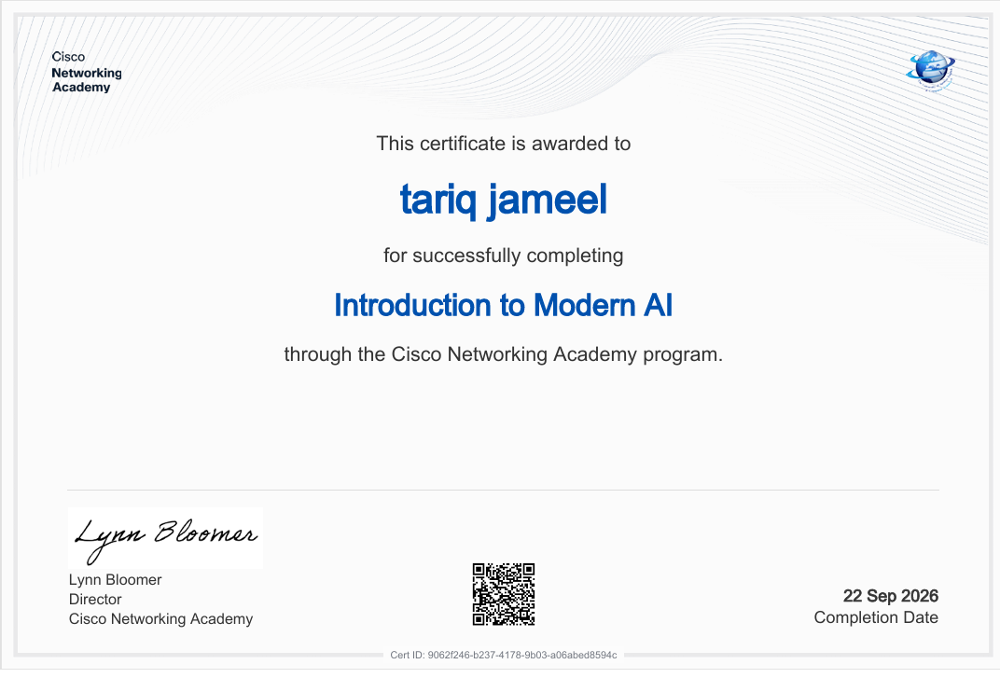
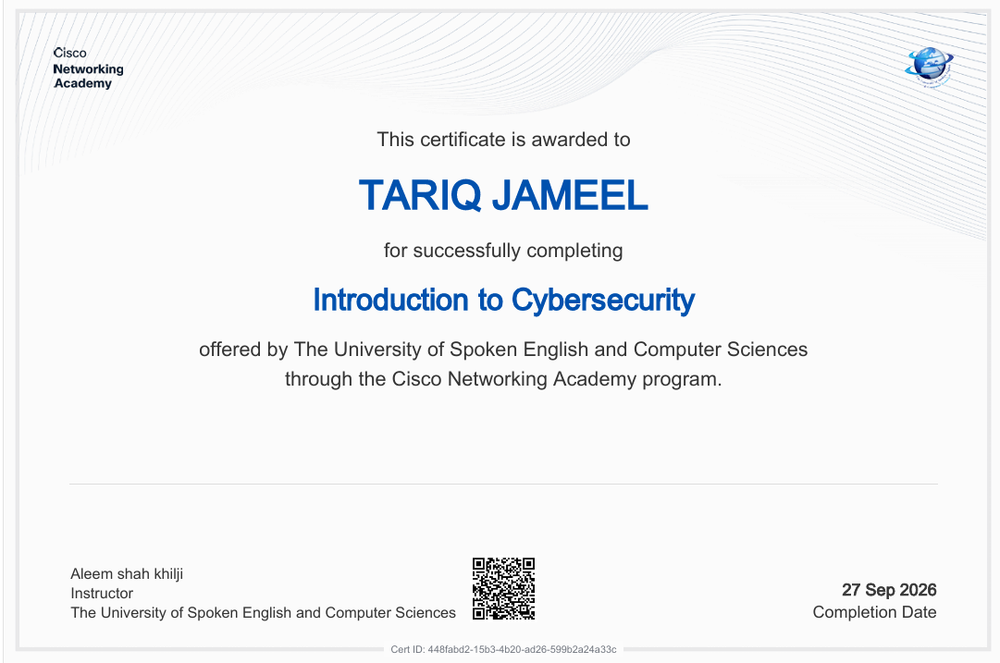

# Hi there, I'm Tariq Jameel! 👋

### 👨‍💻 Full Stack Web Developer | 🛡️ Future Cyber Security Expert

I am a passionate **BS Computer Engineering** student at **CECOS University**, driven by a deep interest in secure systems, modern technology, and web development. I love exploring how things work under the hood, breaking systems to understand how to secure them, and building interactive web applications.

---

### 🚀 About Me
- 🎓 I’m currently studying **BS Computer Engineering** at [CECOS University](https://www.cecos.edu.pk/).
- 💻 I’m actively learning and building projects as a **Full Stack Web Developer**.
- 🐧 I spend a lot of my time working with **Kali Linux**, diving deep into networking, penetration testing, and system administration.
- 🎯 **My Future Goal:** To become a highly skilled **Cyber Security Professional** protecting digital infrastructures from emerging threats.
- 💡 **Fun Fact:** Aside from coding and hacking, I enjoy creating tech content, exploring AI prompt engineering, and sharing knowledge with the community!

---

### 🛠️ Tech Stack & Skills

**Cyber Security & Core:**

  
  
  
  

**Web Development:**

  
  
  
  

---

### 📊 GitHub Stats

---

### 📫 Let's Connect!

  
  

### 📜 Certifications & Achievements

| Certificate | Details |
| :---: | :--- |
|  | **Introduction to Modern AI**   **Issuer:** Cisco Networking Academy   **Date:** 22 Sep 2026   **Cert ID:** `9062f246-b237-4178-9b03-a06abed8594c` |
|  | **Introduction to Cybersecurity**   **Issuer:** Cisco Networking Academy / USECS   **Date:** 27 Sep 2026   **Cert ID:** `448fabd2-15b3-4b20-ad26-599b2a24a33c` |
